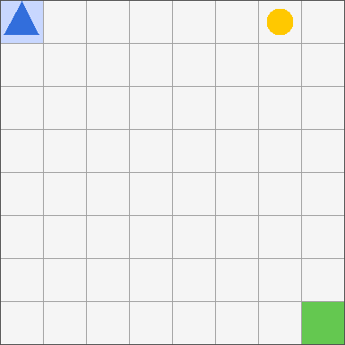
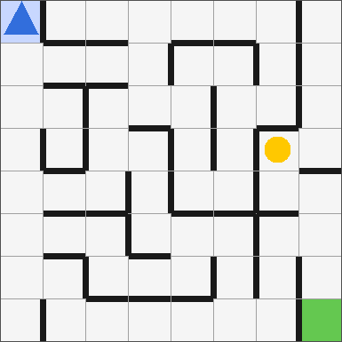
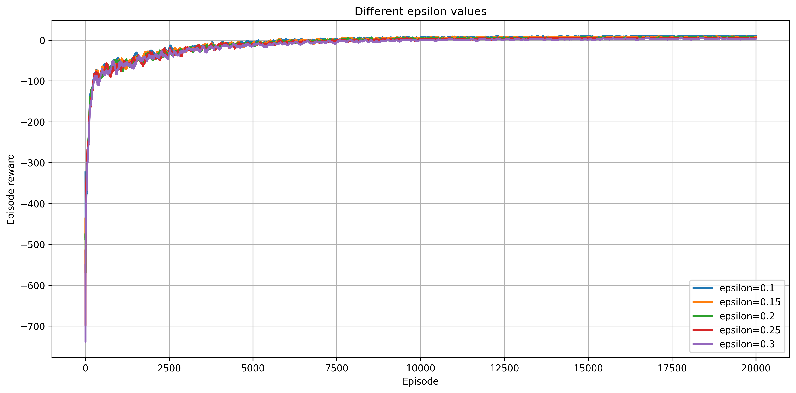
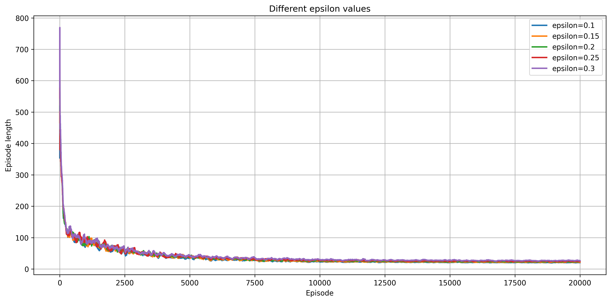
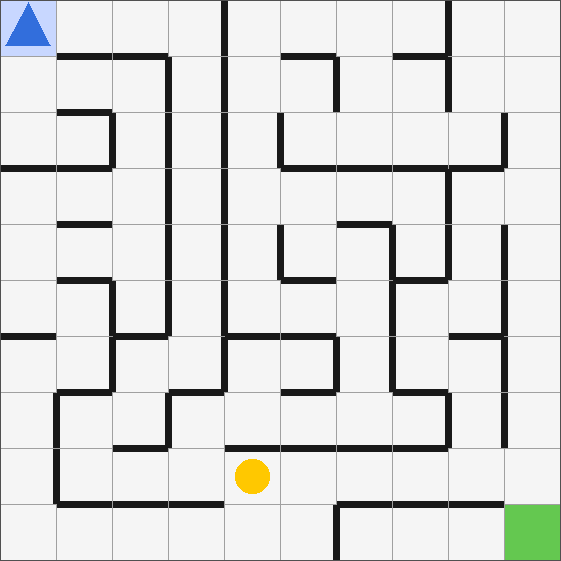

# Tabular Q function methods for gridworld environments

A Python implementation of three tabular reinforcement learning algorithms — **Q-Learning**, **SARSA** and **Monte Carlo Control**— trained and evaluated on a custom GridWorld environment built with the Gymnasium API.

---

## Environments

### GridWorld

<p align="center">
  
</p>

An agent navigates an N×N grid, collects a token, and reaches the goal. The reward is only given for reaching the goal *after* collecting the token, which requires the agent to plan a two-stage path.

| Property | Value |
|---|---|
| Grid size | N×N (default N = 10) |
| Agent start | top-left corner (0, 0) |
| Goal | bottom-right corner (N−1, N−1) |
| Token | random position ≠ (0,0) and ≠ (N−1,N−1) at episode start |
| Actions | `{up, down, right, left}` — boundary moves are no-ops |
| Episode end | agent reaches (N−1,N−1) **or** step limit exceeded (default 4N²) |

**Rewards**

| Event | Default reward |
|---|---|
| Each step | −1 |
| Collecting token | +10 |
| Reaching goal *with* token | +20 |
| Reaching goal *without* token | 0 |

In out experiments we override the defaults.

---

### GridWorld with Walls

<p align="center">
  
</p>

An extension of GridWorld where **static walls** are placed between cells. Walls are generated once at construction time and remain fixed for all episodes. A wall between two adjacent cells prevents movement across that border.

| Property | Value |
|---|---|
| `wall_frac` | fraction of all edges that become walls |
| `seed_walls` | fixes the wall layout for reproducibility |
| Maximum `wall_frac` | (N−1) / 2N ≈ 45% for N = 10 |

**Wall generation** is guaranteed to preserve full connectivity — the agent can always reach the token and the goal regardless of `wall_frac`. This is achieved by:

1. Building a random **spanning tree** of the grid via iterative randomised DFS. These N²−1 edges are protected — they can never become walls.
2. Randomly assigning walls to at most (N−1)² of the remaining non-tree edges.

---

### State Space

The full observation is a 5-tuple:

$$s = (a_x,\ a_y,\ t_x,\ t_y,\ c) \quad \text{where}\ c \in \{0, 1\}$$

- $(a_x, a_y)$: agent position
- $(t_x, t_y)$: token position
- $c$: whether the token has been collected

**State space reduction.** Once the token is collected ($c = 1$), its position is irrelevant. The naïve state space has size $2N^4$, but we reduce it to $N^4 + N^2$ by using two disjoint index ranges:

$$\text{index}(s) = \begin{cases} a_x N^3 + a_y N^2 + t_x N + t_y & \text{if } c = 0 \quad (\text{range } [0,\ N^4)) \\ N^4 + a_x N + a_y & \text{if } c = 1 \quad (\text{range } [N^4,\ N^4 + N^2)) \end{cases}$$

For N = 10 this gives **10,100 states** instead of 20,000 — nearly a 2× reduction.

---

## Methods

All agents maintain a tabular **Q-function** $Q: \mathcal{S} \times \mathcal{A} \to \mathbb{R}$ stored as a matrix of shape $|\mathcal{S}| \times |\mathcal{A}|$, initialised to zero.

---

### Q-Learning

Q-Learning learns the optimal Q-function directly, independently of the behaviour policy, by bootstrapping from the **maximum** Q-value in the next state.

$$Q(s, a) \leftarrow Q(s, a) + \alpha \left[ r + \gamma \max_{a'} Q(s', a') - Q(s, a) \right]$$

Because the target uses $\max_{a'}$, the algorithm is **off-policy**: it converges to $Q^*$ regardless of how actions are chosen during training.

```
Algorithm: Q-Learning
─────────────────────────────────────────────────────────
Initialise Q(s, a) = 0 for all s, a
For each episode:
    s ← env.reset()
    For each step:
        a ← ε-greedy(Q, s) # or softmax
        s', r, done ← env.step(a)
        if done:
            target = r
        else:
            target = r + γ max_a' Q(s', a')
        Q(s, a) ← Q(s, a) + α (target − Q(s, a))
        s ← s'
        if done: break
    ε ← max(ε_min, ε · ε_decay)
```

---

### SARSA

SARSA bootstraps from the Q-value of the **action actually taken** in the next state $a'$, making it on-policy. The policy used to generate $(s, a, r, s', a')$ is the same policy being improved.

$$Q(s, a) \leftarrow Q(s, a) + \alpha \left[ r + \gamma Q(s', a') - Q(s, a) \right]$$

Because $a'$ is sampled from the current (exploratory) policy, SARSA is more conservative than Q-Learning — it accounts for the fact that the agent will continue to explore in $s'$.

```
Algorithm: SARSA
─────────────────────────────────────────────────────────
Initialise Q(s, a) = 0 for all s, a
For each episode:
    s ← env.reset()
    a ← ε-greedy(Q, s)
    For each step:
        s', r, done ← env.step(a)
        a' ← ε-greedy(Q, s')
        if done:
            target = r
        else:
            target = r + γ · Q(s', a')
        Q(s, a) ← Q(s, a) + α · (target − Q(s, a))
        s ← s',  a ← a'
        if done: break
    ε ← max(ε_min, ε · ε_decay)
```

---

### First-Visit Monte Carlo Control

Monte Carlo control waits for the **complete episode** to finish, then updates every first-visited $(s, a)$ pair using the actual discounted return $G_t$:

$$G_t = r_{t+1} + \gamma r_{t+2} + \gamma^2 r_{t+3} + \cdots$$

$$Q(s_t, a_t) \leftarrow Q(s_t, a_t) + \alpha \left[ G_t - Q(s_t, a_t) \right]$$

Unlike TD methods, MC requires no bootstrapping and has zero bias (returns are exact), but has higher variance and cannot learn from incomplete episodes.

```
Algorithm: First-Visit Monte Carlo Control
─────────────────────────────────────────────────────────
Initialise Q(s, a) = 0 for all s, a
For each episode:
    s ← env.reset()
    trajectory ← []
    Collect full episode:
        a ← ε-greedy(Q, s)
        s', r, done ← env.step(a)
        trajectory.append((s, a, r))
        s ← s'
        if done: break
    G ← 0
    visited ← {}
    For (s, a, r) in reversed(trajectory):
        G ← r + γ · G
        if (s, a) not in visited:
            visited.add((s, a))
            Q(s, a) ← Q(s, a) + α · (G − Q(s, a))
    ε ← max(ε_min, ε · ε_decay)
```

---

## Exploration Strategies

All agents support two exploration strategies, switchable via the config.

### ε-Greedy

With probability $\varepsilon$ the agent selects a random action; otherwise it acts greedily:

$$
a = \begin{cases}
\text{random} & \text{with probability } \varepsilon
\newline \arg\max_{a'} Q(s, a') & \text{with probability } 1 - \varepsilon
\end{cases}
$$

Additionally $\varepsilon$ can decay each episode: $\varepsilon \leftarrow \max(\varepsilon_{\min},\ \varepsilon \cdot d_\varepsilon)$.

### Softmax with temperature

All actions are sampled proportionally to their exponentiated Q-values, controlled by a temperature $\tau > 0$:

$$\pi(a \mid s) = \frac{\exp\left(Q(s, a)/\tau\right)}{\sum_{a'} \exp\left(Q(s, a')/\tau\right)}$$

- High $\tau$: near-uniform distribution (more exploration)
- Low $\tau$: distribution concentrates on the greedy action

$\tau$ decays multiplicatively each episode: $\tau \leftarrow \max(\tau_{\min},\ \tau \cdot d_\tau)$.


---

## Experiments

Experiments were run on 10×10 GridWorld and GridWorld-with-Walls environments with 20,000 training episodes.

In all our experiments we used discounting factor $\gamma = 0.99$. Learning rate $alpha$ for SARSA and Q-learning is 0.1 and for Monte Carlo control it is 0.05.

For measuring the performance of the methods we use:
-  Success Rate: the ratio of successfully terminated episodes where agent collected the token and reached the goal
- Mean (successful) episodes length: the mean length of all successful epsiodes

### 1. Reward Shaping

In this section we run experiments only with simple GridWorld environment without walls. Also, as for now we use only Q-learning algorithm.

The reward structure has a large impact on convergence. We test 2 reward patterns:
1. **Step penalty** (`step_penalty = −1`): in theory should encourage short paths
2. **No step penalty** (`step_penalty = 0`): in theory may provide unoptimal paths but doesn't penalize exploration

We first run experiments with `step_penalty = −1`



Mean episode reward (undiscounted) during training for different epsilon values for Q-learning algorithm.



Mean episodes lengths (undiscounted) during training for different epsilon values for Q-learning algorithm.

In this particular case epsilon value has little effect on the results.


#### Full comparison:

#### 1. **Step penalty** (`step_penalty = −1`)
| Method         | Parameters                       | Average episode length | Success Rate |
|----------------|----------------------------------|------------------------|--------------|
| Epsilon const  | ε = 0.15                         | 35.69                  | 0.982        |
| Epsilon decay  | ε = 1, Decay = 0.9999            | 41.56                  | 0.976        |
| Softmax        | Temperature = 3, Decay = 0.9999  | 40.62                  | 0.977        |


#### **No step penalty** (`step_penalty = 0`)
| Method         | Parameters                         | Average episode length | Success Rate |
|----------------|------------------------------------|------------------------|--------------|
| Epsilon const  | ε = 0.9                            | 18                     | 1.0          |
| Epsilon decay  | ε = 1, decay = 0.9999              | 18.02                  | 1.0          |
| Softmax        | Temperature = 3, decay = 0.9999    | 18.3                   | 1.0          |


We can see that agent performs better when `step_penalty = 0`. Further, we use only this setting.


### 2. Methods comparion

Now to make learning harder for agents we switch to environmnet with walls.

First, we search optimal action sampling hyperparameters for Q-learning, SARSA and Monte Carlo control. Results for each method are listed below:

#### 1. **Q-learning**
| Method              | Parameters                        | Average episode length | Success Rate |
|---------------------|-----------------------------------|------------------------|--------------|
| Epsilon const       | ε = 0.9                           | 29                     | 0.86         |
| Epsilon decay       | ε = 1.0, decay = 0.9999           | 25                     | 0.48         |
| Softmax with decay  | Temperature = 3, decay = 0.9999   | 31                     | 0.95         |


#### 2. **SARSA**
| Method             | Parameters                        | Average episode length | Success Rate |
|--------------------|-----------------------------------|------------------------|--------------|
| Epsilon const      | ε = 0.9                           | 27                     | 0.64         |
| Epsilon decay      | ε = 1.0, Decay = 0.9999           | 25                     | 0.37         |
| Softmax with decay | Temperature = 5, Decay = 0.9999   | 30                     | 0.95         |

#### 3. **Monte Carlo control**
| Method             | Parameters                        | Average episode length | Success Rate |
|--------------------|-----------------------------------|------------------------|--------------|
| Epsilon const      | ε = 0.9                           | 26                     | 0.64         |
| Epsilon decay      | ε = 1.0, Decay = 0.9999           | 30                     | 0.87         |
| Softmax with decay | Temperature = 3, Decay = 0.9999   | 32                     | 0.83         |


All the methods proved to be quite sensitive to hyperparameters. We can see that SARSA and Q-learning perform on par. They both reach the best success rate of 0.95 for Softmax with decay action sampling. Monte Carlo control method doesn't reach Success rate of 0.9.

Interestingly, the best average episode length is not reached for the optimal action sampling strategy. Actually, it is quite opposite: when success rate it the lowest then the average episode length is the lowest. This pattern is consistent for all 3 methods.

We think that this phenomena happens because of concentrated exploration of a narrow part of state space. When agent has low success rate it didn't have enough exploration. There are many specific token positions which agent doesn't know how to reach. However, due to such limited scope, during training agent explores known to him part of the environment very well. Actually, it explores this narrow region of token positions better than the agents who explored all the token positions uniformly well. So, on validation when accounting only for successful episodes it manages to reach goal by a more affecient path.

Additionally, longer paths are harder for agent to accomplish. So suppose we have 2 agents: one who accomplished long path and the other who doesn't. In the first case the path makes the average episode length statistic bigger but it also makes success rate better. But in the second case it gives no contribution to the average episode length worsening only success rate.

## Example of a trained agent navigating in the environment with walls




---

## Usage

### Install

```bash
pip install -r requirements.txt
```

### Configure

Use `config.yaml` to set experiment hyperparameters:

```yaml
env:
  type: GridWorldEnv          # or GridWorldWithWallsEnv
  n: 10
  wall_frac: 0.1             # only for GridWorldWithWallsEnv
  seed_walls: 0
  max_steps: 1000
  step_penalty: -1
  collect_reward: 10.0
  goal_reward: 10.0

agent:
  algorithm: q_learning       # q_learning | sarsa | monte_carlo
  alpha: 0.1
  gamma: 0.99
  exploration: softmax        # epsilon_greedy | softmax
  temperature: 5.0
  temperature_decay: 0.9999
  min_temperature: 0.01

train:
  save_dir: runs/myexp
  n_episodes: 20000
  log_interval: 500
  seed: 42
```

### Train

```bash
python train.py --config config.yaml
```

### Evaluate

```bash
python eval.py --save-dir runs/myexp --n-episodes 1000 --seed 0
```

